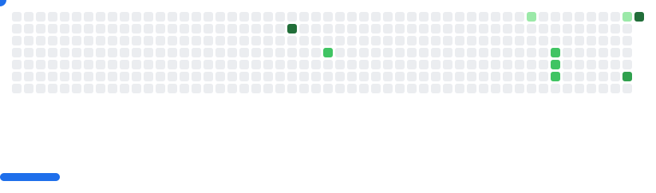

<!-- my-badges start -->

<!-- my-badges end -->

# 👋 Hi there, I'm YanleiZhao

<table>
<tr>
<td width="56%" valign="top">

## 关于我 / About Me

我是一名喜欢把想法做成产品的 **全栈折腾型工程师**，关注 **NVH 工程分析、AI 应用、英语学习工具与实用型 Web 产品**。

我喜欢从真实问题出发，把工程经验、自动化流程和 AI 能力组合成可以直接使用的工具：从移动端噪声振动分析，到 AI 辅助学习与内容生产。

I am a hands-on full-stack engineer building practical tools across NVH analysis, AI applications, English learning, and web products. I enjoy turning real problems into usable software through rapid prototyping and continuous refinement.

- 🔭 当前方向：NVH 分析工具、AI 工作流与移动端工程应用
- 🌱 持续探索：TypeScript、Python、前端体验与智能自动化
- 🧭 工作方式：快速构建、真实验证、持续迭代
- 🛠️ 偏好项目：解决具体问题、能真正交付和使用的工具

</td>
<td width="44%" valign="middle">

</td>
</tr>
</table>

## 🤗 Welcome

## 🧭 GitHub Radar

## 🧱 Contribution Breakout

<picture>
  <source media="(prefers-color-scheme: dark)" srcset="./images/breakout-dark.svg" />
  <source media="(prefers-color-scheme: light)" srcset="./images/breakout-light.svg" />
  
</picture>

## 🗺️ Project Map

| 方向 | 项目 | 数据 | 说明 |
| :--- | :--- | :---: | :--- |
| NVH Engineering | [NVH_Analysis](https://github.com/YanleiZhao-lab/NVH_Analysis) |  | 面向工程现场的移动端噪声、振动与声振粗糙度快速分析工具 |
| AI + English | [IELTS-Typing_Pro](https://github.com/YanleiZhao-lab/IELTS-Typing_Pro) |  | 融合打字训练、IELTS 练习与 Gemini AI 反馈的学习平台 |
| AI Workflow | [wechat-codex-autowrite](https://github.com/YanleiZhao-lab/wechat-codex-autowrite) |  | 从抓取、标准化到写作审核的 Codex 内容生产流水线 |
| Creative Web | [xiaohuajia](https://github.com/YanleiZhao-lab/xiaohuajia) |  | 面向儿童的轻量网页绘画应用，图片处理全部在浏览器本地完成 |
| Knowledge Hub | [ai-new-hub](https://github.com/YanleiZhao-lab/ai-new-hub) |  | 基于 VitePress 的 AI 新闻聚合与知识发布平台 |

## 🧰 Tech Stack

`NVH Analysis` · `AI Applications` · `Full-stack Prototyping` · `English Learning` · `Automation`

## 📊 GitHub Statistics

## 🌈 3D Contributions

## ⚡ Recent Activity

<!--RECENT_ACTIVITY:start-->
- ⭐ [WUBING2023/PaperSpine](https://github.com/WUBING2023/PaperSpine): Starred the repository
- ⭐ [aznikline/academic-skills](https://github.com/aznikline/academic-skills): Starred the repository
- ⭐ [DELONG-L/Academic-Paper-Skills](https://github.com/DELONG-L/Academic-Paper-Skills): Starred the repository
- ⭐ [srizzon/git-city](https://github.com/srizzon/git-city): Starred the repository
- ⭐ [getagentseal/codeburn](https://github.com/getagentseal/codeburn): Starred the repository
<!--RECENT_ACTIVITY:end-->

**Build for real problems. Test in the real world. Keep improving.**

